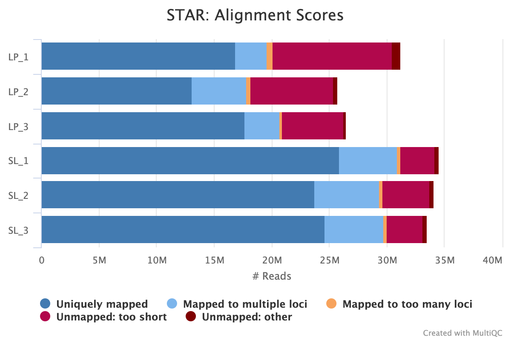
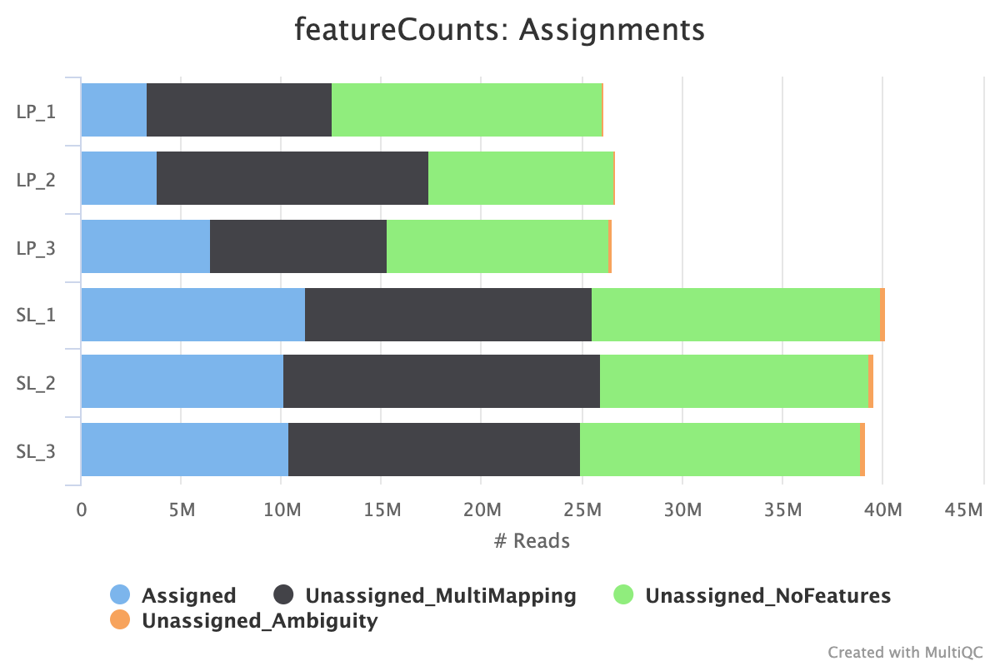

# Introduction

The genetic mechanisms behind the tumor progression of the two types of non small cell lung cancers are vastly different[1]. They have distinct genetic markers and different tumor microenvironments[2]. Compared to LUAD, the oncogenic mechanisms of LUSC is under studied. Prior work has revealed that the transcription factor SOX2 promotes tumor associated neutrophils(TAN) specifically in squamous carcinomas[2]. At the same time, it is known that the difference of mutational landscapes and genetic expressions of LUSC can be used as indicators of oncogenesis[3]. We hypothesize that SOX2 overexpression is a viable marker for the oncogenic progress of LUSC, in the sense that it promotes microenvironment changes, suppresses other TS genes and regulates functions related to tumorigenesis with high sensitivity. With RNA-seq data from genetically engineered SL tumors(SOX2 overxpressed) and LP tumors(SOX2 clinically expressed), we will examine the expression data and gene ontology of DEGs across these two conditions to test our hypothesis.

# Results

## Dataset is noisy but statistically viable for analysis

We have a relatively noisy dataset on our hand especially given the small sample number. Running MultiQC showed that the dataset has various issues with sequencing. The LP samples have pretty low fractions of unique reads and the GC contents of all samples have peaks at around 82% GC. Feature counting also produced relatively low feature assignment rate even after adapter trimming and de-duplication. Ideally further clean-up need to be performed and more samples has to be sequenced so that the conclusions will be more concrete. However, statistical analysis of the count data showed a reasonable tightness around the fitted dispersion before and after shrinkage. We also observe enough statistical power on the fold changes to reject null hypothesis with confidence. In conclusion the dataset is noisy but can be used to produce useful conclusions.

## SOX2 overexpression promotes suppression of known tumor suppressor genes

To observe the impact of SOX2 overexpression on tumor suppressor genes, we pick 4 known tumor suppressor(TS) genes that are deferentially expressed to look at there expression across conditions. We can see that for LP samples which have the clinical level of SOX2 expression all TS genes are up-regulated. Correspondingly for SL samples which have overexpressed SOX2 levels, we see all TS genes being down-regulated. Therefore, we can conclude that SOX2 promotes suppression of these tumor suppressor genes. The gene set selected is consists of known TS of lung cancer(NKX2-1, NKX3-1) and TS that are not previously associated with lung cancer(PIK3R1, ALOX12). Since the genetic mechanism of LSCC is unknown, it would be interesting to look at these down-regulated tumor suppressor genes and identify their roles in the oncogenic process of LSCC tumors.

## SOX2 overexpression regulates biological functions related to oncogenisis

To examine the function of SOX2 overexpression, we selected the top up-regulated and down-regulated DEGs across the conditions to look at their biological functions. We notice the genes up-regulated in the SL tumors are related to functions such as structural molecular activities of epithelial(KRT20), I Immunoglobulin receptor binding(Ighv1-20), and negative regulation of T cell activation(TIGIT). The genes down-regulated in SL tumors are related to functions such as positive regulation of innate immune response(BPIFA1), cellular response to interleukin 4(RPL3), and positively regulates lymphocyte proliferation(IL12A). The up/down regulation of these functions would all potentially have oncogenic effect. Therefore we conclude that SOX2 overexpression promotes LUSC tumorigenesis. More detailed protein expression analysis centered around these top DEGs would be interesting to verify this conclusion.

## SOX2 promotes tumor associated neutrophil(TAN) recruitment with high sensitivity

To examine the sensitivity of SOX2 promoting neutrophil response in LSCC, we compared between two conditions that don't have a very large difference in terms of SOX2 expression. SL tumors are genetically engineered to overexpress SOX2. LP tumors also display SOX2 overexpression compare to LUAD tumors but retain clinical level. We perform DE analysis and take all up-regulated genes in SL tumors. Gene ontology enrichment analysis showed that the most enriched GO term is neutrophil activation involved in immune response, showing the high sensitivity of SOX2 promoting TAN recruitment. Therefore, combined with previous conclusions, there is a potential of SOX2 becoming a genetic marker for LUSC tumor progression and recurrence.

# Methods

## Data acquisition and pre-processing

The data is publicly available with GEO accession ID GSE119246. The two groups of samples considered in this study are LCSC tumors from genetically engineered mouse models with SOX2 over-expression(SL group) and LCSC tumors from the Lkb1fl/fl;Ptenfl/fl mouse models which retains clinical level genetic expression profiles(LP group). RecoverAll™ Total Nucleic Acid Isolation Kit for FFPE was used to isolate RNA from FFPE tissues. Illumina TruSeq Stranded mRNA Sample Preparation Kit is used for RNA-seq library preparation. The FFPE preserved tissues went through H&E stain to confirm the presence of tumors. Then 10 -- 14 pieces of each sample isolated from serial sections were pooled in a microcentrifuge tube containing 100% ethanol. The sequencing platform used is Illumina HiSeq 2500. The data was archived at SRA so we choose to use the tool fastq-dump in the SRA toolkit to convert the data to fastq format as follows:

```{bash, eval=FALSE, echo=TRUE}
#!/bin/bash

all_sra=$(ls SRR*)
for file in $all_sra
do
  sratoolkit.2.10.9-ubuntu64/bin/fastq-dump $file -O fastq/
done
```

## Alignment and QC

After obtaining the fastq files, we run fastqc to check data quality. This dataset consists of single-end RNA-sequencing data of mouse lung tumor tissues. The sequencing quality centers around 35 phred score which is acceptable. The LP samples have high duplication rate and the GC content has an extra peak despite of having no adapter contamination. Based on the QC we conclude that de-duplication needs to be performed after alignment. There also might be over-represented sequences since the GC content is a bit skewed and we can look for specific adapter contents to trim off. The figures are generated by running multiqc.

```{r}
knitr::include_graphics(c("seq_q.png","dup.png"))
```

After the initial QC we proceed to align the reads to a reference genome. We choose to use STAR aligner since alignment of RNA-seq data can benefits from junction awareness. The script used to align one file is shown below. We choose to output sorted BAM format.

```{bash, eval=FALSE, echo=TRUE}
#!/bin/bash

fastq_path=$1
index_path=$2
prefix=$3
STAR --runMode alignReads \
       --runThreadN 16 \
       --genomeDir $index_path \
       --outFileNamePrefix $prefix \
       --readFilesIn $fastq_path \
       --outSAMtype BAM SortedByCoordinate \
       --outSAMattributes 'NH' 'HI' 'AS' 'nM' 'MD'
```

Alignment jobs are submitted to the computation nodes since STAR requires large memory usage to store the genome index. The script for submitting one job is shown below. We choose to submit individual jobs for individual alignment tasks since with 10 cores and 36G memory approximately 3 jobs can be running at the same time. One alignment job takes roughly 3 to 3.5 hours to complete.

```{bash, eval=FALSE, echo=TRUE}
#!/bin/bash -l

#SBATCH --partition=angsd_class
#SBATCH --nodes=1
#SBATCH --ntasks=10
#SBATCH --job-name=single_align
#SBATCH --time=12:00:00
#SBATCH --mem=36G

spack load star@2.7.0e
./align_single.sh ../fastq/LP/SRR7656005.1.fastq /home/nib4003/ANGSD_2021_hw/final_project/star_mouse_genome_index LP_1
```

After alignment we run multiqc to look into alignment quality. We see that all 6 samples have uniquely aligned read percentages larger than 50% and the rates range from 51.1% to 75%. Therefore, The two cohorts have acceptable alignment rates. LP samples have overall less uniquely aligned reads compared to SL samples due to high duplication content in the raw sequencing data.

```{r}

```

In general the data is acceptable for further analysis. But steps like trimming over-represented sequences and de-duplication can benefits the analysis.

## Feature Counting

After alignment QC, we start to count the features. The newer version GTF file(M25) is used here to identify the meta-features. We choose to use the tool featureCounts to generate a count table at gene level. The script to urn featureCounts is shown below. There are several flag choices worth explaining. The -s flag is set to 2 since our data is reversely stranded. The -T flag is number of threads used while counting the features.

```{bash, eval=FALSE, echo=TRUE}
#!/bin/bash

spack load subread
input_files=$(ls ./bam/*.bam)
gtf='./gencode.vM25.annotation.gtf'

featureCounts -a $gtf -T 20 -s 2 -F 'GTF' -g 'gene_id' $input_files -o fc_gene.txt
```

After generating the count table, we run multiqc again to check how many reads are aligned to features. After running de-duplication with samtools on the BAMs, we have the following aligned rates. We can see that the aligned rate of samples ranges from 12% to around 30%. Most of the unaligned reads are caused by a read being mapped to multiple loci since featureCounts ignores multiple mapping reads. Also fair amount of reads are at regions that have no features, i.e. intron regions or immediate regions after or before gene bodies. We can see that samtools deduplication might not have worked since LP samples still have low assignment rates and overall less feature assignments than SL samples. The underlying reason might be that samtools only looks at 5' ends of reads. In other words it is only looking at reads that start at the same place and removing those. Due to time factor we have to continue the analysis, however for more concrete conclusions these QC issues need to be resolved.

```{r}

```

## Load and Process Feature Count Matrix

After obtaining the count matrix we import it to R for data analysis. We first change the column names to the meaningful sample names instead of the bam file names. We notice that there are a lot of duplicated rows in the count matrix. Therefore, we use the fac2spares function to create a sparse design matrix using gene_id as the underlying factor. This computes a linear transformation which when applied to the original count matrix will increase its sparsity. Here it will sum up the feature count values in rows with identical row names. After applying the transformation matrix, we obtain a sparse count matrix that does not have duplicated rows. We then filter out genes that are not expressed by getting rid of rows that have all 0 count values. The 6 by 6 section of the processed count matrix is displayed.

```{r}
suppressMessages(library(Matrix))
suppressMessages(library(biomaRt))
```

```{r}
rc <- read.table('fc_gene.txt', header=TRUE)
names(rc) <- c(names(rc)[1:6],
               paste("LP", c(1:3), sep='_'),
               paste("SL", c(1:3), sep='_'))
```

```{r}
# design matrix (genes X exons)
M_gene_exon <- fac2sparse(rc$Geneid)
# exon counts
cts_exon_sample <- as.matrix(rc[, -seq(1,6)])
# gene counts
cts_gene_sample <- M_gene_exon %*% cts_exon_sample
cts_gene_sample <- cts_gene_sample[rowSums(cts_gene_sample) > 0, ]
head(cts_gene_sample)
```

## Build DESeq Object

With the count matrix we can now build the DESeq object so we can perform differential expression analysis. To build a DESeq object we need a countData matrix and a column data matrix. The countData matrix is the count matrix we processed above. The column data matrix will be the grouping metadata of this assay. We set the row names as sample names and for the data itself we provide grouping formula where 'SL' are assigned to SL samples and 'LP' are assigned to LP samples. We also perform rlog transformation to normalize the count data for visualization.

```{r}
suppressMessages(library(DESeq2))
suppressMessages(library(magrittr))
```

```{r}
cond <- c(rep('LP', 3), rep('SL', 3))
sample.mat <- DataFrame(group=cond, row.names = names(rc)[7:ncol(rc)])
deseq <- DESeqDataSetFromMatrix(countData = cts_gene_sample, 
                                colData = sample.mat,
                                design = ~ group)
```

```{r}
normed <- rlog(deseq)
head(assay(normed))
```

## Exploratory Analysis

With the DESeq object and the normalized count matrix we can now perform some exploratory analysis to see if our samples form appropriate clusters and can be efficiently separated.

### PCA

We first perform PCA to look at the sample's variance distributions. The PCA plot is shown below. We can see that dimension 1 represents 49% of the variance and dimension 2 represents 29% of the variance. From this we can see that the dataset requires higher dimension to fully represent its within-group variance since the first 2 dimensions represents only 78% of the variance. We also notice that the samples in the SL group cluster well together but one sample in the LP group( most likely LP_1) is causing this cluster to have high with-in cluster spread. This issue needs to be addressed when performing hierarchical clustering.

```{r}
plotPCA(normed, intgroup='group')
```

### Clustering based on correlation

After the PCA we then look into if we can cluster the samples appropriately with hierarchical clustering using correlation coefficients as the linkage matrix. We first extract the normalized count matrix and compute sample-level pairwise pearson correlation. From the PCA above we know that the clusters might have high variances within. Therefore, we choose to use Ward's linkage algorithm to minimize the with-in cluster variance instead of the complete hierarchical clustering method. The distance metric in this algorithm is energy distance which is the distance between two statistical distributions. As we see in the denrogram the sample clusters do represent the different sample groups.

```{r}
normed.mat <- assay(normed)
cor.mat <- cor(normed.mat, method='pearson')
as.dist(1 - cor.mat) %>% hclust(., method='ward.D') %>% plot(., labels=colnames(normed.mat), 
                                  main='Hierarchical clustering of samples with Ward Linkage')
```

## Differential Gene Expression Analysis

The exploratory analysis showed that our data is separable by the two different conditions LP and SL. We can then perform the differential gene expression analysis. We will discuss statistical properties of the fit, show the null hypothesis rejection and mapping of gene IDs to gene names, and show DEGs supporting the conclusion made in the results section.

### Model fit and statistical analysis

After fitting the model we want to make sure that our model was a good fit. To show that we perform two statistical analyses. The DE algorithm will estimate gene-level dispersion with a model that is inversely related to mean. Therefore, genes with higher mean expression will be fitted to have a low dispersion so that the dispersion estimator reflects with-in gene variance excluding mean expression. The algorithm then fits a curve to the gene level dispersion. A GLM is then fitted with a prior obtained by shrinking dispersion towards the fitted curve. So here we display the fitted prior of the gene dispersion. A good fit would have most points scattered around the curve before and after shrinkage. We see that the prior model fitted to our dataset is a good estimate since most points clusters around the fitted curve and we see a better fit after shrinkage. This shows that our data is not too noisy to perform maximum a priori so our log2 fold changes obtained are statistically meaningful.

```{r}
glm <- suppressMessages(DESeq(deseq))
plotDispEsts(glm)
```

We then perform another statistical analysis on the computed log2 fold changes. Notice that the null hypothesis of DE analysis is that all genes have the same expression levels across the conditions. So for our fold changes to be valid, we need to see most of the genes have similar expression levels across the conditions. To ensure this is the case we perform a shrinkage based on Bayesian estimation of the shrinkage factor parameter. A Cauchy distribution is fitted for each covariate of the GLM to filter away the genes with very low expressions. The MA plot after shrinkage showed that most of our genes have low level of expression changes since most points centers around 0 fold change. The significant DE genes are scattered away from the general population. We can conclude that our fold changes are fit for hypothesis testing.

```{r}
shrink.lfc <- lfcShrink(glm, coef="group_SL_vs_LP", type="apeglm")
plotMA(shrink.lfc)
```

### Hypothesis rejection and name mapping

The statistical analyses showed that our dataset has reasonable statistical stability and the fold changes computed are appropriate for hypothesis testing. We then proceed to reject the null hypothesis for a gene with a type I error of 0.1 based on its adjusted p-value. We have a total of 1997 significant genes after the hypothesis testing.

```{r}
deg.res <- results(glm)
deg.res <- deg.res[!is.na(deg.res$padj), ]
sum(deg.res$padj < 0.1)
```

To produce meaningful results, we need to map the ensemble gene IDs to gene symbols. We do this using the biomaRt package which provides a database querying system to quickly produce annotations. To map the genes, we first assemble the mouse dataset. We are mapping from gene ID to gene names, so we choose the ensemble_gene_id filter and grab external_gene_name as annotation results. The values will be all significant genes. We show the top 6 rows of the annotation here to display the mapping. After obtaining the mapping annotations, we drop the genes that are not mapped and convert all gene ids to gene names with the annotation data frame. We change the gene names with rownames() so we can filter the dataset directly with desired gene names.

```{r}
shrink.lfc <- shrink.lfc[!is.na(shrink.lfc$padj), ]
sig.degs <- shrink.lfc[shrink.lfc$padj < 0.1, ]
normed <- normed[rownames(normed) %in% rownames(sig.degs), ]
rownames(sig.degs) <- gsub("\\..*","", rownames(sig.degs))
rownames(normed) <- gsub("\\..*","", rownames(normed))
```

```{r}
library(biomaRt)
ensembl=useMart("ENSEMBL_MART_ENSEMBL", host="uswest.ensembl.org")
ensembl = useDataset("mmusculus_gene_ensembl", mart=ensembl)
ft <- "ensembl_gene_id"
fv <- rownames(sig.degs)
attri <- c('ensembl_gene_id',  'external_gene_name')
annot <- getBM(attributes=attri, 
               filters = ft, 
               values = fv, 
               mart = ensembl)
head(annot)
```

```{r}
sig.degs <- sig.degs[rownames(sig.degs) %in% annot$ensembl_gene_id, ]
normed <- normed[rownames(normed) %in% annot$ensembl_gene_id, ]
gene_id <- rownames(sig.degs)
genes <- c()
for(i in 1:length(gene_id)){
  genes <- append(genes, annot[annot$ensembl_gene_id == gene_id[i], ]$external_gene_name)
}
rownames(sig.degs) <- genes
rownames(normed) <- genes
save(file='sig_degs.rds', sig.degs)
head(sig.degs)
```

### Expression of tumor suppressor genes

In this part we show that SOX2 over-expression promotes suppression of some non small cell lung cancer tumor suppressor genes. Here we show a heatmap of gene expressions of 4 significant deferentially expressed genes that are known tumor suppressors. The target genes are curated into a list and the normalized expression values are extracted to a matrix. We then center the matrix to ensure the heatmap display different color patterns across the conditions. The pheatmap package is used to display the heatmap and the clustering based on the expression values.

```{r}
library(pheatmap)
```

```{r}
normed.mat <- assay(normed)
gene_list <- c('Nkx2-1','Pik3r1', 'Alox12', 'Nkx3-1')
g.mat <- normed.mat[gene_list, ]
g.mat <- g.mat - rowMeans(g.mat)
pheatmap(g.mat, main='Expression of tumor suppressor genes across conditions')
```

### Top up-regulated and down-regulated genes across conditions

We then look at the top up-regulated and down-regulated genes and see if we can pick up any information. We select the top/down regulated genes by sorting the list of all significant DEGs. If we sort by decreasing order, the most up-regulated genes will be at the top. If we sort by ascending order, the most down regulated genes will be at the top. We then select the top 10 genes from each group and plot a heatmap of expression data and examine the related biological functions.

```{r}
top.degs <- rbind(sig.degs[head(order(sig.degs$log2FoldChange, decreasing = TRUE),n=10),],
                  sig.degs[head(order(sig.degs$log2FoldChange),n=10),])
top.deg.mat <- normed.mat[rownames(top.degs), ]
top.deg.mat <- top.deg.mat - rowMeans(top.deg.mat)
pheatmap(top.deg.mat, main='Top DEGs across conditions')
```

## Functional Pathway Analysis

### Gene ontology enrichment across conditions

After obtain the set of significant DEGs, we perform a gene ontology term enrichment analysis to see what are the most important functional pathways. We use the tool enrichR which takes gene list and test for GO term enrichment. We feed in the genes that are significantly up-regulated in SL samples(SOX2 overexpression) and the EnrichR package will compute number of overlapping genes and a p-value of enrichment.

```{r}
library(enrichR)
```

```{r}
dbs <- c("GO_Molecular_Function_2018", "GO_Biological_Process_2018")

top.up.genes <- sig.degs[sig.degs$log2FoldChange>0, ]
enriched <- enrichr(rownames(top.up.genes), dbs)
```

```{r}
plotEnrich(enriched[[2]], showTerms = 20, numChar = 70, y = "Count", orderBy = "P.value")
save(file='enriched.rds', enriched)
```

# Discussion

The purposed study has some limitations worth discussing. First of all, due to time constraints only 6 total samples(3 for each condition) is analyzed. On top of that, QC of the samples showed problems of high duplication rate, potential high level of over-represented sequences, and low level of assigned features. These are all factors that could cause the analysis results to skew. Therefore, before performing any analyses on DEGs or GOs, we performed statistical analysis to ensure we have acceptable data and enough power to perform the downstream analyses. Ideally more operations on the raw fastq files and the BAM files need to be performed and more replicates should be processed and aligned. Secondly, an important limitation is that all purposed conclusions are based only on RNA-seq data. To get concrete results we need to look into other NGS modalities or experimental methods to verify our conclusions. For example Chip-seq at SOX2 binding sites and scRNA-seq on two types of tumor tissues would be helpful to reestablish some of the results. Lastly, the genome assembly used in this study when doing alignment versus doing feature counting is inconsistent. This might cause the exclusion of some important genes. However, the existing genes form a complete story so we can stick to these for now. Optimally we want to unify the usage of different assemblies.

# Generated Datasets

| Name         | Description           |
|--------------|-----------------------|
| fc_gene.txt  | feature count matrix  |
| enriched.Rds | GO enrichment of DEGs |
| sig_degs.Rds | All significant DEGs  |

# Reference

1\. Relli, Valeria, Marco Trerotola, Emanuela Guerra, and Saverio Alberti. 2018. "Distinct Lung Cancer Subtypes Associate to Distinct Drivers of Tumor Progression." *Oncotarget* 9 (85): 35528--40.

2\. Mollaoglu, Gurkan, Alex Jones, Sarah J. Wait, Anandaroop Mukhopadhyay, Sangmin Jeong, Rahul Arya, Soledad A. Camolotto, et al. 2018. "The Lineage-Defining Transcription Factors SOX2 and NKX2-1 Determine Lung Cancer Cell Fate and Shape the Tumor Immune Microenvironment." *Immunity* 49 (4): 764--79.e9.

3.Xiong, Donghai, Jing Pan, Yuxin Yin, Hui Jiang, Eva Szabo, Ronald A. Lubet, Yian Wang, and Ming You. 2018. "Novel Mutational Landscapes and Expression Signatures of Lung Squamous Cell Carcinoma." *Oncotarget* 9 (7): 7424--41.
